<h1 align="center">
  <br>
  AutoRepo
  <br>
</h1>

<h4 align="center">用 Git 的方式，管理你的爱车档案</h4>

<p align="center">
  <strong>简体中文</strong> •
  <a href="./README.md">English</a> •
  <a href="#功能特性">功能</a> •
  <a href="#快速开始">快速开始</a> •
  <a href="#系统架构">架构</a> •
  <a href="#部署指南">部署</a>
</p>

<p align="center">
  
  
  
  
  
  
</p>

---

## AutoRepo 是什么？

**AutoRepo** 借用 Git 版本控制的概念，将车辆维保记录转化为直观、开发者友好的体验：

| Git 概念 | AutoRepo 对应 |
|---------|--------------|
| Repository (仓库) | 你的爱车 |
| Commit (提交) | 维修/保养记录 |
| Issue (议题) | 定期维护任务 |
| HEAD (指针) | 当前状态（里程/车况） |

适合以下用户：

- 追踪每一次改装、维修和保养
- 监控总投入和费用构成
- 用照片记录（每条记录最多9张）
- 导出专业 PDF 报告
- 永不丢失车辆历史记录

---

## 功能特性

### 核心功能

- **Git 风格时间轴** — 可视化展示车辆变更历史
- **多车管理** — 一个应用管理多辆车
- **费用追踪** — 工时费、配件费、自动汇总
- **图片上传** — 每条记录最多9张照片
- **PDF 导出** — 专业报告，用于保险或转售
- **搜索筛选** — 按类型、日期、里程或关键词
- **待办任务** — 计划保养任务，设置优先级

### 用户体验

- **深色模式** — 自动检测系统偏好
- **实时同步** — 微信云托管驱动
- **安全可靠** — JWT 认证，用户数据隔离
- **原生体验** — 自定义导航，流畅动画
- **左滑操作** — 左滑删除车辆和任务

---

## 界面预览

<table>
  <tr>
    <td align="center">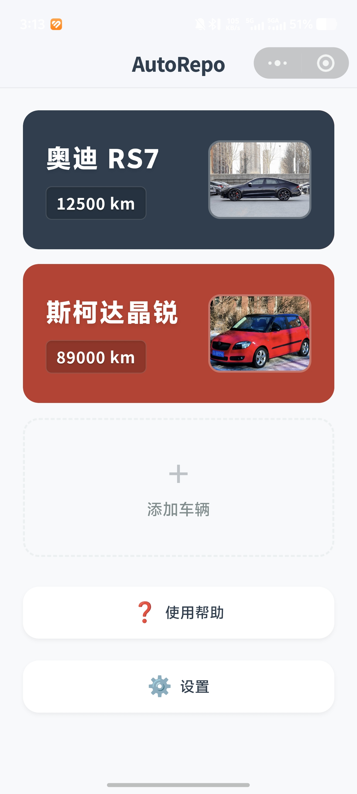<br/><b>主页面</b></td>
    <td align="center">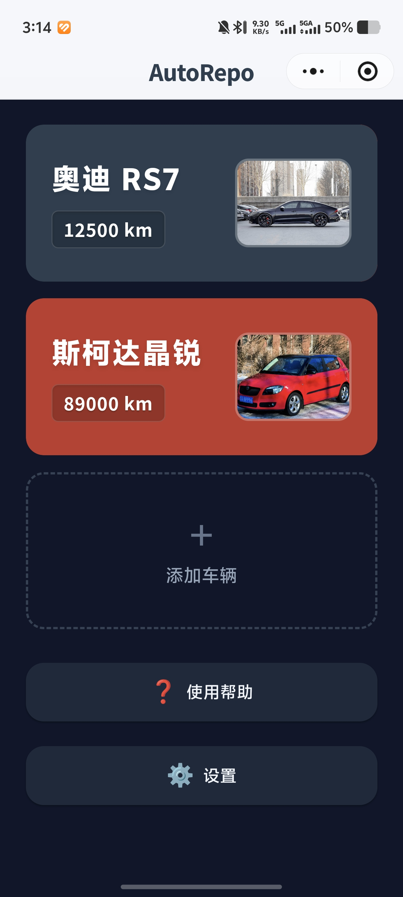<br/><b>深色模式</b></td>
    <td align="center">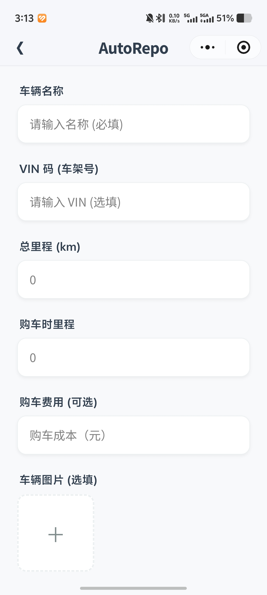<br/><b>添加车辆</b></td>
  </tr>
  <tr>
    <td align="center">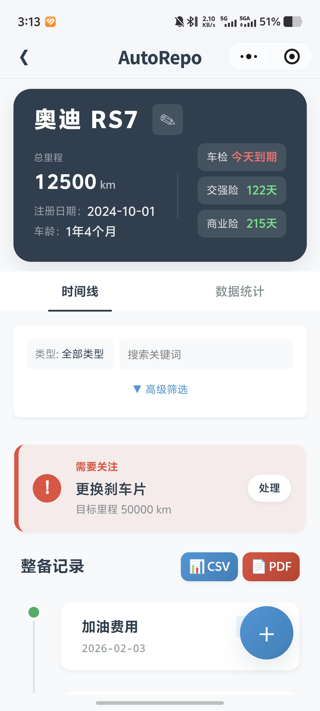<br/><b>车辆详情</b></td>
    <td align="center">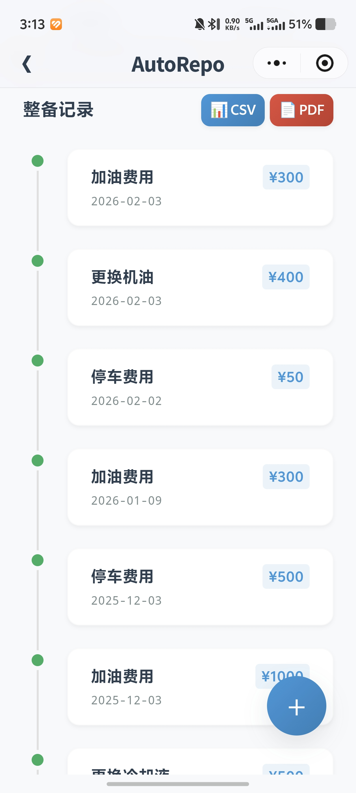<br/><b>时间线</b></td>
    <td align="center">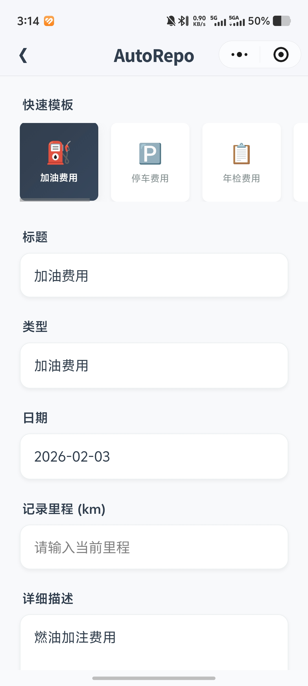<br/><b>添加记录</b></td>
  </tr>
  <tr>
    <td align="center">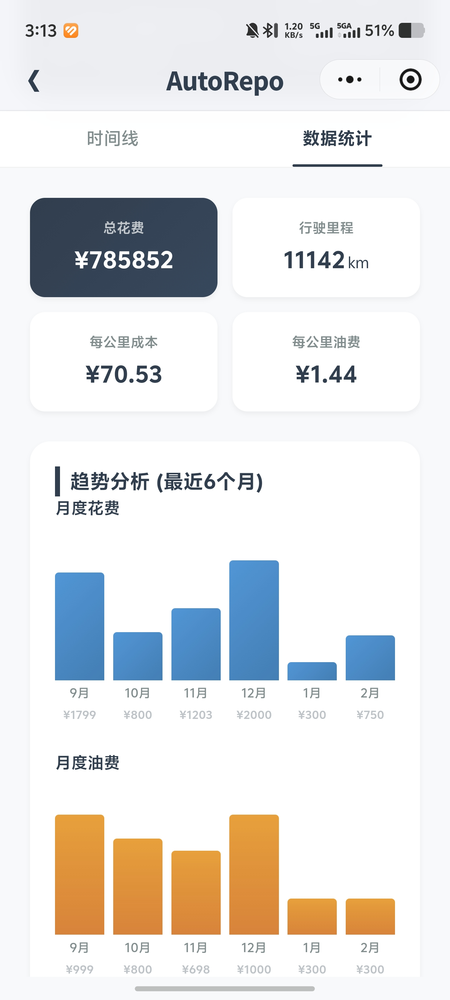<br/><b>费用趋势</b></td>
    <td align="center">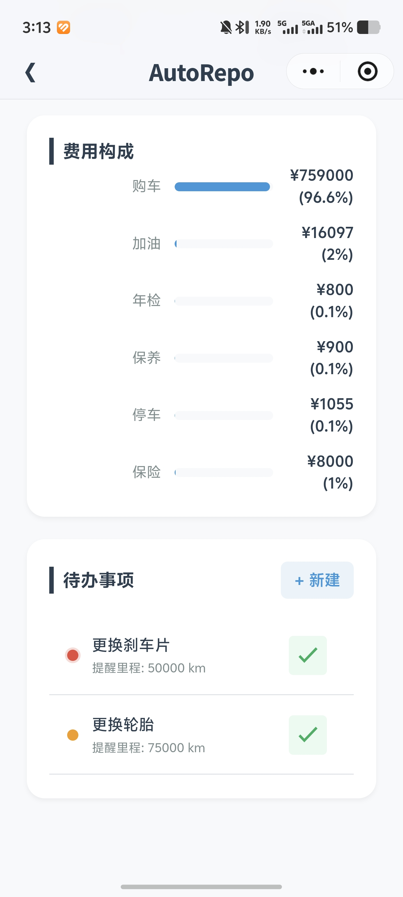<br/><b>费用构成</b></td>
    <td align="center">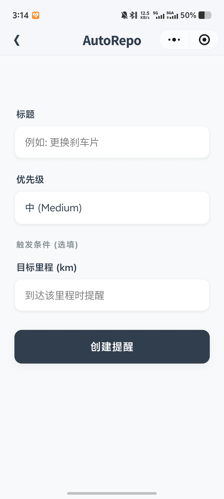<br/><b>创建提醒</b></td>
  </tr>
  <tr>
    <td align="center">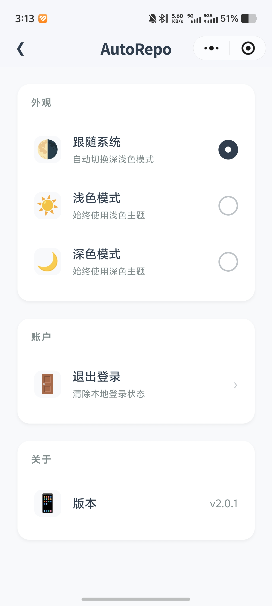<br/><b>设置</b></td>
    <td align="center">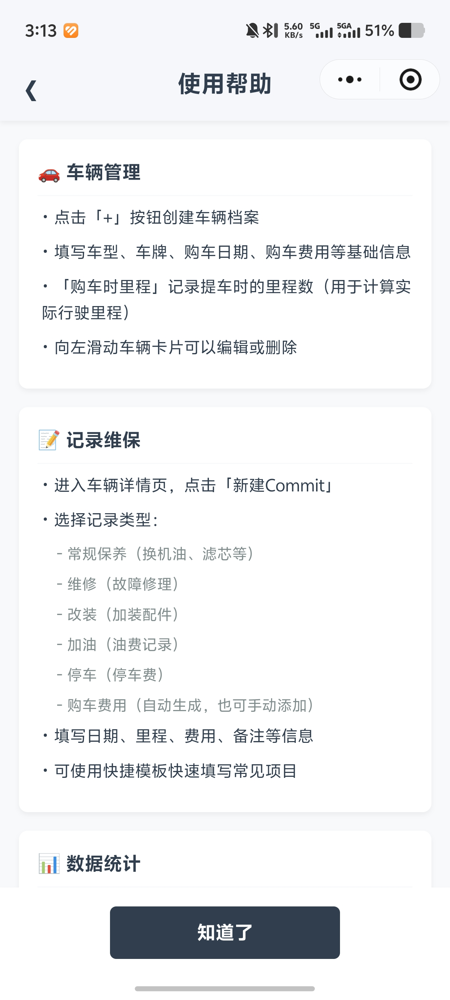<br/><b>使用帮助</b></td>
    <td align="center">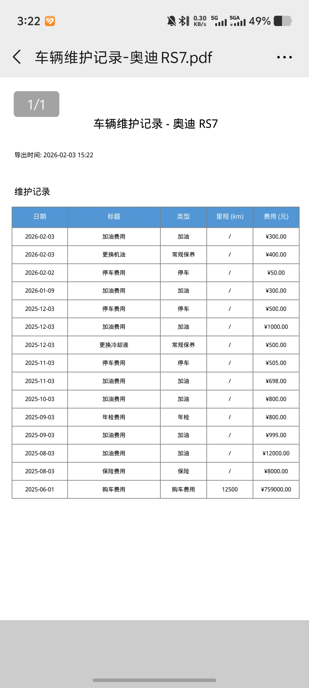<br/><b>PDF 导出</b></td>
  </tr>
</table>

---

## 系统架构

```
┌─────────────────────────────────────────────────────────────────┐
│                        微信小程序                                │
│  ┌─────────────┐  ┌─────────────┐  ┌─────────────┐              │
│  │   时间轴    │  │   仪表盘    │  │    设置     │              │
│  │   (Repo)    │  │   (Stats)   │  │   (Theme)   │              │
│  └──────┬──────┘  └──────┬──────┘  └─────────────┘              │
│         │                │                                       │
│  ┌──────┴────────────────┴──────┐                               │
│  │      api.ts (HTTP 客户端)     │                               │
│  │   • JWT 认证 • 重试逻辑       │                               │
│  └──────────────┬───────────────┘                               │
└─────────────────┼───────────────────────────────────────────────┘
                  │ wx.cloud.callContainer
                  ▼
┌─────────────────────────────────────────────────────────────────┐
│                  微信云托管 (Docker)                             │
│  ┌──────────────────────────────────────────────────────────┐   │
│  │                   FastAPI 后端                            │   │
│  │  ┌────────┐  ┌────────┐  ┌────────┐  ┌────────┐          │   │
│  │  │ /repos │  │/commits│  │/issues │  │ /auth  │          │   │
│  │  └────┬───┘  └────┬───┘  └────┬───┘  └────┬───┘          │   │
│  │       └───────────┴───────────┴───────────┘               │   │
│  │                       │                                    │   │
│  │              ┌────────┴────────┐                          │   │
│  │              │   MongoDB/Mock  │                          │   │
│  │              └─────────────────┘                          │   │
│  └──────────────────────────────────────────────────────────┘   │
└─────────────────────────────────────────────────────────────────┘
```

### 技术栈

| 层级 | 技术 |
|------|------|
| 前端 | TypeScript, SCSS, 微信小程序 |
| 后端 | Python 3.9+, FastAPI, Pydantic |
| 数据库 | MongoDB (Motor 异步驱动) |
| 认证 | JWT + 微信登录 |
| PDF | ReportLab (中文字体支持) |
| 部署 | Docker, 微信云托管 |

---

## 快速开始

### 前提条件

- Python 3.9+
- 微信开发者工具
- （可选）Docker, MongoDB

### 1. 后端配置

```bash
# 克隆仓库
git clone https://github.com/lecrix/auto-repo.git
cd auto-repo/backend

# 安装依赖
pip install -r requirements.txt

# 创建 .env 文件
cp .env.example .env
# 编辑 .env 填入你的凭证

# 启动开发服务器
uvicorn main:app --reload --host 0.0.0.0 --port 8000
```

**环境变量** (`.env`):

```bash
WECHAT_APPID=你的微信AppID
WECHAT_SECRET=你的微信密钥
JWT_SECRET=至少32位的随机字符串
MONGO_URL=mongodb://localhost:27017  # 可选，默认使用 MockDB
```

> 没有 MongoDB 时，系统会自动使用 MockDB（基于文件）进行本地开发。

### 2. 前端配置

1. 打开 **微信开发者工具**
2. 导入 `miniprogram/` 目录
3. 设置 AppID（或使用测试模式）
4. 在 `miniprogram/config.ts` 中配置：
   ```typescript
   const CURRENT_MODE: 'dev' | 'device' | 'prod' = 'dev'
   ```
5. 编译预览

---

## 部署指南

### 微信云托管（推荐）

详细说明请参阅 [docs/DEPLOY.md](./docs/DEPLOY.md)。

**主要优势：**

- 无需域名备案
- 自动扩缩容（闲置时缩至零）
- 内置 HTTPS
- 内网直连访问

---

## 项目结构

```
auto-repo/
├── backend/                 # FastAPI 后端
│   ├── main.py              # 应用入口
│   ├── auth.py              # JWT + 微信登录
│   ├── routes.py            # API 端点
│   ├── models.py            # Pydantic 数据模型
│   ├── database.py          # MongoDB 连接
│   └── mock_db.py           # 开发用备用数据库
│
├── miniprogram/             # 微信小程序
│   ├── pages/               # UI 页面
│   ├── components/          # 可复用组件
│   └── services/            # API 客户端, 认证
│
├── docs/                    # 文档
│   ├── DEPLOY.md            # 部署指南
│   ├── FEATURE_SUMMARY.md   # 功能总结
│   ├── TESTING_GUIDE.md     # 测试指南
│   └── WORK_SUMMARY.md      # 开发历史
│
├── AGENTS.md                # AI 助手指南
└── CONTRIBUTING.md          # 贡献指南
```

---

## API 概览

| 端点 | 方法 | 说明 |
|------|------|------|
| `/auth/login` | POST | 微信 code → JWT token |
| `/repos` | GET/POST | 列出/创建车辆 |
| `/repos/{id}` | GET/PUT/DELETE | 车辆增删改查 |
| `/commits` | GET/POST | 列出/创建记录 |
| `/commits/{id}` | GET/PUT/DELETE | 记录增删改查 |
| `/repos/{id}/issues` | GET/POST | 维护任务 |
| `/issues/{id}` | GET/PATCH/DELETE | 任务增删改查 |
| `/repos/{id}/stats` | GET | 费用统计 |
| `/repos/{id}/export/pdf-base64` | GET | PDF 导出 |

本地运行时可访问 `http://localhost:8000/docs` 查看完整 API 文档。

---

## 路线图

- [x] 核心 UI/UX 及后端集成
- [x] 多用户认证
- [x] 图片上传及 PDF 导出
- [x] 数据可视化与统计
- [x] 微信云托管部署
- [x] 待办详情页及左滑操作
- [ ] OCR 票据扫描
- [ ] 保养提醒（推送通知）
- [ ] 社交分享与社区功能

---

## 参与贡献

欢迎贡献！请先阅读 [CONTRIBUTING.md](./CONTRIBUTING.md)。

```bash
git checkout -b feature/amazing-feature
git commit -m '添加超棒的功能'
git push origin feature/amazing-feature
# 发起 Pull Request
```

---

## 许可证

本项目基于 MIT 许可证开源 - 详见 [LICENSE](LICENSE) 文件。

---

<p align="center">
  为爱车人士用心打造
  <br>
  <a href="https://github.com/lecrix/auto-repo/issues">报告 Bug</a> •
  <a href="https://github.com/lecrix/auto-repo/issues">功能建议</a>
</p>
